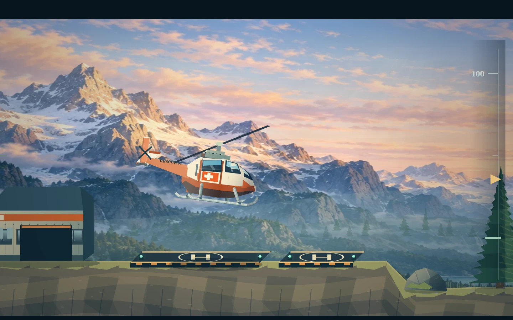

# Expedition graphics overhaul

A substantial visual pass on top of 5f14e00, preserving Claude's flight model.

- Three new hand-painted 1536 × 1024 panoramas: sunrise Alps, moonlit snow and tropical limestone jungle. Optimized WebP assets total about 1.1 MB.
- Ivory and rescue-orange helicopter, projected cabin cross, pilot, cockpit reflections, engine louvers, tail lettering and matching crash panel paint. Existing airframe silhouette, gear geometry, turn projection and damage deformation retained.
- New sedimentary terrain, mineral weathering, layered conifer crowns, detailed scenery rocks, rescue station materials, rooftop panels, illuminated landing pads, safety clothing and cargo colours.
- Warm expedition menu and panel finish; no layout, input or hit-area changes.
- Versioned script/style URLs and distinct asset names avoid retaining old art after deployment.

Validation: full simulation suite and opaque obstacle-edge tests pass. Exact source comparison outside named drawing functions and image URLs confirms no change to physics, camera, controls, collision shapes, missions, saves or audio. Native Canvas scenes and close-up helicopter renders reviewed.

Generated using the built-in image tool. Assets live at dist/alpine-expedition.webp, dist/night-expedition.webp and dist/jungle-expedition.webp. Direction: premium full-bleed hand-painted side-view wilderness, deep atmospheric perspective, detailed natural stone, open sky above, no text, UI, aircraft or characters. Alpine sunrise: warm snow ridges, teal shadows, glacial lake; night: moonlit peaks, subtle turquoise aurora; jungle: emerald limestone valleys, thin waterfalls and turquoise river.

---

# Graphics review — Claude baseline b1717ad

Rendering-only pass. Flight, controls, camera, level data, collision geometry, damage, crash simulation and HUD are unchanged. Source comparison verified every byte outside the terrain/obstacle art block.

Found and corrected:
- Tapered pillars had irregular painted caps inside a flat collision top. Their solid outline now follows the existing trapezoid.
- Roofs collided across the full 20-unit drip band, but only scattered teeth were visible. The complete band is now stone, with inset mineral details and a readable lower edge.
- Boulder art occupied only part of rectangular colliders. These obstacles now read as cut rock blocks with fractured faces.
- Bridge art suggested open trusses and solid piers outside its collider. Closed riveted girders now fill exactly the existing obstacle footprint.
- The turf slab extended 12 units above the ground contour. The solid soil surface now starts at the sampled ground height.

Stone uses deterministic mineral planes, seams, weathered caps and restrained edge lighting. Bridges use inset metal panels, diagonal reinforcement, rivets and end markings. No render-time simulation randomness is consumed.

Validation: existing full simulation suite passes, including impacts, dents, crash completion, shaft flights and mission completion. Added native Canvas pixel checks for opaque contact edges and absence of misleading exterior walls on all four obstacle types. Actual scene and isolated obstacle renders visually inspected. These checks do not claim all possible collision edge cases are perfect; collision mathematics was deliberately preserved.
